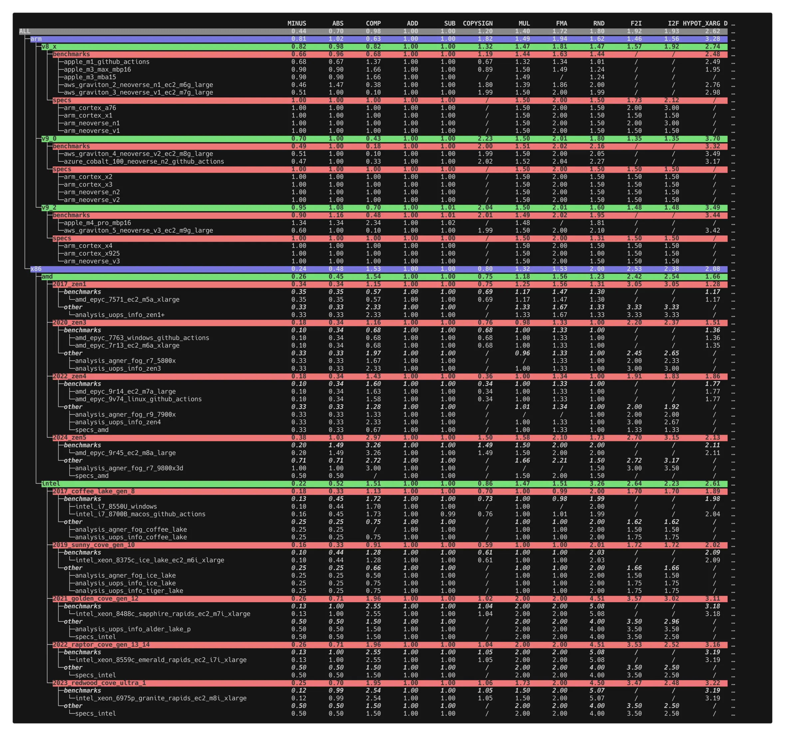

# Built-in data

The package ships a collection of data files, each describing the relative
cost of floating-point operations on one specific CPU — either measured by
this package's own benchmark suite or derived from published latency numbers.
The default FLOP weights are an aggregate over this whole collection, and
`get_builtin_flop_weights(key_filter=...)` (see
[FLOP weights](flop_weights.md#custom-aggregated-flop-weights)) lets you
aggregate over any subset of it. This page documents what the collection
contains and how the keys that select from it are structured.

## Key anatomy

Every entry is identified by a `.`-separated key that mirrors its location
in the data tree:

```
<isa> . <µarch family> . <source type> . <entry>
```

- **ISA**: `arm` or `x86`.
- **µarch family**: for arm, the ISA version (`v8_x`, `v9_0`, `v9_2`); for
  x86, the vendor followed by a microarchitecture generation
  (`amd.2020_zen3`, `intel.2021_golden_cove_gen_12`, ...) — so x86 keys are
  one level deeper.
- **source type**: where the numbers come from (see below).
- **entry**: the individual CPU / data source.

A `key_filter` is a plain substring match against these keys, so any level
works as a filter: `"arm"`, `"zen"`, `"benchmarks"`, `"apple_m4"`,
`"x86.intel"`, ...

## Source types

Per the [methodology](analysis_methodology.md), three types of sources are
used:

- **`benchmarks`**: results of this package's own benchmark suite
  (`counted_float benchmark`), run on the machine named by the entry.
  These cover *all* FLOP types, including operations without hardware
  support (`sin`, `pow`, ...).
- **`specs`**: instruction latencies from official vendor documentation.
  These only cover operations with hardware instructions (arithmetic,
  `sqrt`, conversions) — the transcendental functions are missing.
- **`analysis_*`** (under `other/` for x86): instruction latencies measured
  by third parties, notably [Agner Fog](https://agner.org/optimize/) and
  [uops.info](https://uops.info/). Like spec sheets, these cover hardware
  instructions only.

## Available entries

Running `counted_float show-data` (see the
[CLI reference](cli.md#show-built-in-data)) prints the full collection as a
tree, alongside the weights each entry and each aggregation level resolves
to:



The colored bands are the interior (aggregate) nodes — one shade per level of
the [key hierarchy](#key-anatomy) — while the plain rows are the individual
data sources; `/` marks a weight that is absent and could not be imputed (the
trailing flop-type columns are cut from the screenshot; run the command for
the full matrix). The same collection in tabular form:

<!-- BEGIN generated: builtin-data-table -->
| ISA | µarch family | Entries |
|---|---|---|
| arm | `v8_x` | benchmarks: `apple_m1_github_actions`, `apple_m3_max_mbp16`, `apple_m3_mba15`, `aws_graviton_2_neoverse_n1_ec2_m6g_large`, `aws_graviton_3_neoverse_v1_ec2_m7g_large` — specs: `arm_cortex_a76`, `arm_cortex_x1`, `arm_neoverse_n1`, `arm_neoverse_v1` |
| arm | `v9_0` | benchmarks: `aws_graviton_4_neoverse_v2_ec2_m8g_large`, `azure_cobalt_100_neoverse_n2_github_actions` — specs: `arm_cortex_x2`, `arm_cortex_x3`, `arm_neoverse_n2`, `arm_neoverse_v2` |
| arm | `v9_2` | benchmarks: `apple_m4_pro_mbp16`, `aws_graviton_5_neoverse_v3_ec2_m9g_large` — specs: `arm_cortex_x4`, `arm_cortex_x925`, `arm_neoverse_v3` |
| x86 | `amd.2017_zen1` | benchmarks: `amd_epyc_7571_ec2_m5a_xlarge` — other: `analysis_uops_info_zen1+` |
| x86 | `amd.2020_zen3` | benchmarks: `amd_epyc_7763_windows_github_actions`, `amd_epyc_7r13_ec2_m6a_xlarge` — other: `analysis_agner_fog_r7_5800x`, `analysis_uops_info_zen3` |
| x86 | `amd.2022_zen4` | benchmarks: `amd_epyc_9r14_ec2_m7a_large` — other: `analysis_agner_fog_r9_7900x`, `analysis_uops_info_zen4`, `specs_amd` |
| x86 | `amd.2024_zen5` | benchmarks: `amd_epyc_9r45_ec2_m8a_large` — other: `analysis_agner_fog_r7_9800x3d`, `specs_amd` |
| x86 | `intel.2017_coffee_lake_gen_8` | benchmarks: `intel_i7_8550U_windows`, `intel_i7_8700B_macos_github_actions` — other: `analysis_agner_fog_coffee_lake`, `analysis_uops_info_coffee_lake` |
| x86 | `intel.2019_sunny_cove_gen_10` | benchmarks: `intel_xeon_8375c_ice_lake_ec2_m6i_xlarge` — other: `analysis_agner_fog_ice_lake`, `analysis_uops_info_ice_lake`, `analysis_uops_info_tiger_lake` |
| x86 | `intel.2021_golden_cove_gen_12` | benchmarks: `intel_xeon_8488c_sapphire_rapids_ec2_m7i_xlarge` — other: `analysis_uops_info_alder_lake_p`, `specs_intel` |
| x86 | `intel.2022_raptor_cove_gen_13_14` | benchmarks: `intel_xeon_8559c_emerald_rapids_ec2_i7i_xlarge` — other: `specs_intel` |
| x86 | `intel.2023_redwood_cove_ultra_1` | benchmarks: `intel_xeon_6973p_granite_rapids_linux_github_actions`, `intel_xeon_6975p_granite_rapids_ec2_m8i_xlarge` — other: `specs_intel` |
<!-- END generated: builtin-data-table -->

See [CPU architecture scope](cpu_architectures_scope.md) for why these CPUs
and no others.

The full, current key list can always be enumerated programmatically:

```python
from counted_float import BuiltInData

>>> list(BuiltInData.get_flop_weights_dict())
['arm.v8_x.benchmarks.apple_m1_github_actions', ...]
```

## Aggregation and missing data

A selection of these entries is combined into one set of weights (what
`get_builtin_flop_weights()` does, and what produces the package's default
weights) by hierarchical geometric-mean aggregation, imputing missing values
at every level — so the incomplete spec-sheet and third-party entries don't
bias the result. See [How the final weights are
computed](flop_weights.md#how-the-final-weights-are-computed) for the full
explanation.
