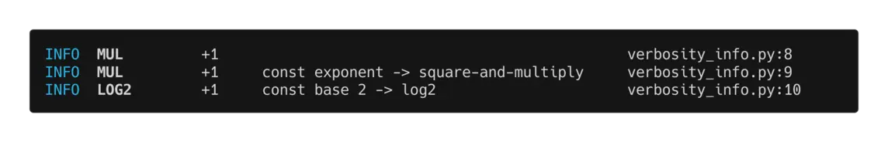
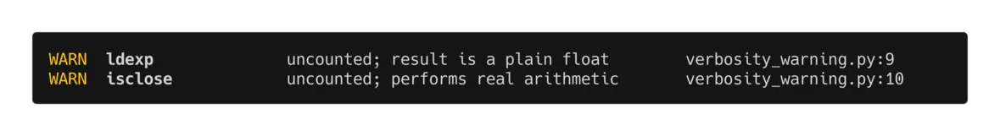
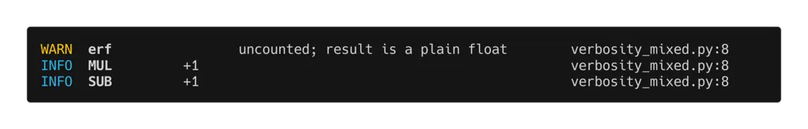

# Counting FLOPs

## The `CountedFloat` class

In order to instrument all floating point operations with counting
functionality, the `CountedFloat` class was implemented, which is a drop-in
replacement for the built-in `float` type. The `CountedFloat` class is a
subclass of `float` and is "contagious", meaning that it will automatically
ensure results of math operations where at least one operand is a
`CountedFloat` will also be a `CountedFloat`. This way we ensure flop counting
is a 'closed system'.

`CountedFloat` deliberately does **not** support subclassing — it is `final`,
and deriving from it raises `TypeError` at class-definition time. That is a
performance decision: with no subtype possible, every operator can tell a runtime
value from a constant with an exact type check (`type(x) is CountedFloat`) rather
than an `isinstance` test, which costs roughly twice as much on precisely the
path that runs most — an operand that is a plain float, i.e. a constant to be
folded. Supporting subclasses would also mean carrying the operand's own type
through every result construction, on that same hot path.

So hold a `CountedFloat` inside your own type rather than deriving from it.

On top of this, `math` module functions that require counting (`sqrt`, `log2`,
`pow`, ...) are also instrumented: while a `FlopCountingContext` is active
(see below), they are temporarily replaced by counting equivalents. Outside
such a context — including at plain `import` time — the `math` module is left
completely untouched (see [Math patching semantics](math_patching.md) for the
exact contract).

**Example**:

```python
from counted_float import CountedFloat

cf = CountedFloat(1.3)
f = 2.8

result = cf + f  # result = CountedFloat(4.1)

is_float_1 = isinstance(cf, float)  # True
is_float_2 = isinstance(result, float)  # True
```

## The counting model: what gets counted and why

The counting model is a contract with two sides:

- **Your side:** wrap every *runtime input* of the algorithm you want to
  measure in `CountedFloat` at its boundary. Contagion does the rest —
  everything derived from those inputs stays counted automatically.
- **The library's side:** count every FLOP that a compiled (C/Rust/...) port
  of your algorithm would execute *on data derived from those inputs*.

From this contract follows a clean rule for everything else: **constants are
free.** Any plain float encountered mid-computation is, by the contract, not
an input — so it must be a constant of the algorithm (a literal, a
coefficient, a tolerance), and operations purely among constants are work a
compiled port would fold at compile time or precompute. This is why e.g.
`math.sqrt(3)` counts nothing: the port ships `sqrt(3)` as a precomputed
constant.

This gives the counting model one unified principle:

> **Only `CountedFloat` values are runtime data. Any non-`CountedFloat`
> numeric operand — int, bool, or plain float — is an algorithm constant that
> a compiled port would fold at compile time.**

Two consequences follow, both applied consistently across operators and
patched `math` functions:

1. **Constants never add cost of their own.** No `I2F` conversion for an int
   operand, no runtime preparation for a float one — the operation *on the
   runtime value* still counts (`cf + 2.0` counts one ADD), but the constant
   contributes nothing extra.
2. **Known constant *values* enable strength reduction.** Constants fold by
   value (an int and an equal-valued plain float compile identically), and
   where the folded value lets a compiled port emit something cheaper than the
   generic operation, the cheaper form is counted:

   | Expression (constant `c`) | Counts |
   |---|---|
   | `x * 1.0` · `x - 0.0` · `x + (-0.0)` | nothing — each is exactly `x` for every `x`, signed zeros included |
   | `x * -1.0` · `x / -1.0` · `(-0.0) - x` | MINUS — a bare sign flip |
   | `x + 0.0` · `x - (-0.0)` · `0.0 - x` | ADD · SUB · SUB — the near-misses: a signed zero makes each one value-changing (`-0.0 + 0.0` is `+0.0`) |
   | `x ** 2` (or `2.0`) | MUL |
   | `x ** n`, integer 2 ≤ \|n\| ≤ 16 | square-and-multiply MULs (`x**3` → 2 MUL, `x**8` → 3 MUL); negative `n` adds one DIV |
   | `x ** -1` | DIV (reciprocal) |
   | `x / 1.0` | nothing (folds away; result stays `CountedFloat`) |
   | `x / c`, power-of-two `c` (either sign) | MUL — `x * (1/c)` is bit-identical exactly there, so a compiler folds it; any other constant divisor stays DIV |
   | `x ** 0.5` / `x ** -0.5` | SQRT / SQRT + DIV |
   | `x ** 1` | nothing (folds away to `x` itself; result stays `CountedFloat`) |
   | `x ** 0` | nothing — IEEE 754 and C99 define `pow(x, 0)` as `1.0` for *every* `x` (nan and infinities included), so the result is the port's compile-time constant and comes back as a **plain float** |
   | `x ** c`, other values | POW |
   | `1.0 ** x` | nothing — the same standards make `pow(1, y)` `1.0` for *every* `y`: the absorbing case on the other operand, likewise a **plain float** constant |
   | `2 ** x` / `10 ** x` | EXP2 / EXP10 (POW for other constant bases) |
   | `math.log(x, 2)` / `math.log(x, 10)` | LOG2 / LOG10 |
   | `math.log(x, c)`, other values | LOG + MUL (`1/log(c)` folds to a constant multiplier, which identity-folds when `log(c)` is exactly ±1.0 — base `math.e` counts a bare LOG) |

   Beyond \|n\| = 16 real compilers' powi expansion varies, so a generic POW
   is a fair stand-in. When the exponent, base, or log base is itself a
   `CountedFloat`, it is genuinely runtime: no folding applies (`x ** y`
   counts POW; `math.log(x, y)` counts LOG per counted operand + DIV).

   Reduction by *value* only earns its keep where the folded form is genuinely
   cheaper — a short chain of multiplies instead of a libm `pow` call is an
   enormous saving. `math.fma` is the deliberate exception: it gets no
   value-based reduction by decree, not by economics. Some variants do have
   bit-exact cheaper respellings (`fma(x, 1.0, z)` is exactly `x + z`), but an
   explicit `fma` is the author demanding one fused instruction with one
   rounding, and the model's compiler never unfuses an author-written `fma` —
   the mirror of the contraction pin that stops it fusing an author-written
   `a*b + c`. Its one fold is structural rather than value-based —
   two constant multiplicands collapse to a single constant, leaving a compiled
   port with a bare add, so that counts ADD. That add then folds like any other
   add with a constant operand: a collapsed constant of exactly `-0.0` drops it
   entirely (`z + (-0.0)` is `z` for every `z`), counting nothing, while a
   `+0.0` product keeps the ADD (`(-0.0) + 0.0` is `+0.0`).

The one place an `I2F` conversion *is* counted is explicit construction from an
int — `CountedFloat(n)`. That is exactly how you opt a genuine runtime integer
(a loop index, a computed count) into the counting model: wrap it, and its
int→float conversion counts like any other FLOP. This is deliberate and
load-bearing: `CountedFloat(n)` is the **only** way a developer can express that
an integer is a genuine runtime value rather than a constant, so the conversion
cannot be excluded here without removing that ability entirely. Counting it is
therefore a pure opt-in that relies on developer discipline to wrap only genuine
runtime integers — a computed count, not a literal `5`. To admit an integer
*constant* without counting its conversion, convert with plain `float(n)` first,
keeping it outside the counting model.

The flip side: an unwrapped runtime input is invisible to the counter — that
is a wrapping error at your algorithm's boundary, not something the library
can detect. When in doubt, wrap.

One more consequence of the context-scoped `math` patching: `math.*` calls
participate in counting (and in contagion) only while a `FlopCountingContext`
is active. Operator-based contagion (`+`, `*`, `**`, ...) works everywhere,
but counts are meant to be read through a context — so the practical rule is
simply: run your measured algorithm inside one.

The account of `float`'s *own* attribute surface — which methods count, which
are reported, which are deliberately uncounted, and the presentation and
pickling contracts — is on [The float surface](float_surface.md).

### What the library will and will not instrument

The library's side of the contract counts what a compiled port would execute —
but only for operations your Python code actually performs. It *instruments*; it
does not offer a vocabulary for *declaring* costs. That boundary explains two
things that would otherwise look inconsistent:

- **`math.fma` is counted; `a*b + c` is not fused.** A compiled port emits a
  fused multiply-add as one instruction with one rounding, and `math.fma`
  (Python 3.13+) is the single place that fusion is observable from Python — so
  it counts as one `FMA`. The operator form is invisible to the interpreter,
  which sees nothing distinguishing it from any other multiply followed by any
  other add, so it stays MUL + ADD.
- **No portable `fma` is provided.** It would be simple to ship a
  `counted_float.fma()` that counts one `FMA` everywhere and computes `x*y + z`
  where `math.fma` is missing. That is deliberately not done. It would turn the
  library from an instrument of what your code executes into a cost-annotation
  API, where a count asserts what you *intend* a port to do rather than
  recording an operation that happened — and it would silently return a
  differently-rounded result depending on the interpreter underneath. Counting
  stays tied to what actually ran.

### What weighted costs mean

Flop weights are **latency** weights: each one is measured from a
dependent-chain benchmark (and, where available, vendor latency tables), so a
weighted total prices every operation as if it waited for the previous one to
finish. That is a good match for dependency-chained code — recursive filters
and scalar iterations, the kind of algorithm this library exists for, where
each step needs the previous step's result. For code with instruction-level
parallelism (independent multiplies in a wide expression, a hand-written
sum of squares), real hardware overlaps work that the weighted sum prices
sequentially — read weighted totals for such structures as upper-ish
estimates rather than expected latencies. The current model prices a
decomposed operation identically to its hand-written expansion and does not
model the overlap; how much of that internal parallelism a weight *should*
capture is a modeling choice, not a law of the counting model.
(`math.dist`, n-ary `math.hypot` and `math.sumprod` are the counterexamples:
their arity-scaled weights are measured on the real algorithm, internal
overlap included — most starkly `sumprod`, whose ~24-instruction compensated
per-element sequence prices at a few ADDs because its lanes overlap.) Counts themselves are unaffected; this nuance
applies only to the weighted totals.

Weights are also **normalized**: every cost is expressed relative to the ADD
latency of the CPUs it was derived from, so ADD always carries weight 1.0.
Two architectures executing some operation at identical absolute latency can
therefore assign it different weights when their ADD latencies differ —
weighted costs compare operations and algorithms *within* one weight set,
not individual flop latencies *across* architectures. This holds at every
aggregation scope: whether you use a single CPU's weights, an architecture
aggregate (`arm`, `x86`), or the overall consensus, ADD is 1.0 and every
weight is comparable to the other weights in that same set — what changes
with the scope is which (group of) architectures the relative costs
represent.

Not everything is counted — see [Known limitations](known_limitations.md) for
what falls outside the counting model (e.g. `numpy` operations).

## FLOP counting context managers

Once we use the `CountedFloat` class, we can use the available context
managers to count the number of flops performed by `CountedFloat` objects.

**Example 1**: _basic usage_

```python
from counted_float import CountedFloat, FlopCountingContext

cf1 = CountedFloat(1.73)
cf2 = CountedFloat(2.94)

with FlopCountingContext() as ctx:
    _ = cf1 * cf2
    _ = cf1 + cf2

counts = ctx.flop_counts()   # {FlopType.MUL: 1, FlopType.ADD: 1}
counts.total_count()         # 2
```

**Example 2**: _math module functions_

```python
import math
from counted_float import CountedFloat, FlopCountingContext

cf1 = CountedFloat(0.81)

with FlopCountingContext() as ctx:
    s = math.sqrt(cf1)  # s = CountedFloat(0.9)

counts = ctx.flop_counts()   # {FlopType.SQRT: 1}
```

Note that `math.*` functions are only instrumented *inside* the context:
outside it, `math.sqrt(cf1)` returns a plain `float` and counts nothing.

**Example 3**: _pause counting 1_

```python
from counted_float import CountedFloat, FlopCountingContext

cf1 = CountedFloat(1.73)
cf2 = CountedFloat(2.94)

with FlopCountingContext() as ctx:
    _ = cf1 * cf2
    ctx.pause()
    _ = cf1 + cf2   # will be executed but not counted
    ctx.resume()
    _ = cf1 - cf2

counts = ctx.flop_counts()   # {FlopType.MUL: 1, FlopType.SUB: 1}
counts.total_count()         # 2
```

**Example 4**: _pause counting 2_

```python
from counted_float import CountedFloat, FlopCountingContext, PauseFlopCounting

cf1 = CountedFloat(1.73)
cf2 = CountedFloat(2.94)

with FlopCountingContext() as ctx:
    _ = cf1 * cf2
    with PauseFlopCounting():
        _ = cf1 + cf2   # will be executed but not counted
    _ = cf1 - cf2

counts = ctx.flop_counts()   # {FlopType.MUL: 1, FlopType.SUB: 1}
counts.total_count()         # 2
```

### Watching what gets counted

A flop counting context can also report as it goes, instead of only counting. Two
levels:

- **`Verbosity.INFO`** — reports every flop it counts.
- **`Verbosity.WARNING`** — reports the operations it could *not* count.

Both write to `stderr`, and `INFO` includes the `WARNING` lines.

**Example 5**: _verbose counting_

<!-- BEGIN generated: snippet-verbosity-info -->
```python
import math

from counted_float import CountedFloat, FlopCountingContext, Verbosity

cf = CountedFloat(1.73)

with FlopCountingContext(verbosity=Verbosity.INFO):
    _ = cf * cf
    _ = cf**2
    _ = math.log(cf, 2)
```
<!-- END generated: snippet-verbosity-info -->

writes to `stderr`:



Every line names the flop type, how many of them that one statement registered,
the rationale where the library applied a rule you did not write out (here:
`cf**2` strength-reduces to a multiply, and a constant base 2 makes `log` a
`log2`), and the line of *your* code that triggered it — never the library
internals that did the counting.

This is the tool for answering "why is this count 14 and not 12?" on a small
snippet. Three things worth knowing:

- **The level applies to the whole thread while the block is open.** A context
  opened inside a verbose one takes over until it exits, whatever level it asks
  for — so a plain `FlopCountingContext()` is how you mute a noisy stretch.
- **Paused flops are not logged**, for the same reason they are not counted.
- **One line per counted flop, with no deduplication.** A loop doing a million
  operations logs a million lines: `INFO` is a microscope for small snippets, not
  a profiler for a whole run.

**Example 6**: _reporting what could not be counted_

<!-- BEGIN generated: snippet-verbosity-warning -->
```python
import math

from counted_float import CountedFloat, FlopCountingContext, Verbosity

cf = CountedFloat(2.5)

with FlopCountingContext(verbosity=Verbosity.WARNING):
    for _ in range(1000):
        _ = math.ldexp(cf, 3)
    _ = math.frexp(cf)
```
<!-- END generated: snippet-verbosity-warning -->

writes:



`WARNING` is for the opposite question: not "why is this count 14?" but "is this
count missing something?". It reports calls that met a `CountedFloat` and could
not be counted — the
[not-instrumented `math` functions](math_patching.md#coverage-of-the-math-module),
whose plain-`float` results also stop counting downstream, and
`as_integer_ratio()`, whose integer parts can silently re-enter float math.
Unlike `INFO`,
each call site is reported only once — the thousand-iteration loop above reports
once, and so does a second run in the same process, exactly as Python's own
warnings behave. That is what keeps this level usable on a full run. And like
`INFO` lines, these reports respect pausing: an uncountable call made while
counting is paused is not reported, for the same reason nothing else is counted
there either.

!!! warning "What `WARNING` can and cannot see"

    It reports operations the library can observe but not count. It is **not** a
    guarantee that the total is complete: a runtime value that entered your
    algorithm as a plain `float` rather than a `CountedFloat` is, by design,
    indistinguishable from a deliberate constant, so the operations on it are
    silently uncounted and nothing warns. Keeping runtime values in
    `CountedFloat` throughout is what makes a count trustworthy; this level only
    catches the boundaries that are visible.

**Example 7**: _both sides in one stream_

`INFO` includes the `WARNING` lines, so a single run shows what was counted and
what was lost, interleaved in the order it happened:

<!-- BEGIN generated: snippet-verbosity-mixed -->
```python
import math

from counted_float import CountedFloat, FlopCountingContext, Verbosity

x = CountedFloat(0.6)

with FlopCountingContext(verbosity=Verbosity.INFO):
    mantissa, _ = math.frexp(x)
    _ = 1.0 - x * mantissa
```
<!-- END generated: snippet-verbosity-mixed -->

writes:



The mantissa `frexp` hands back is a plain `float` — the yellow line reports
that loss — while the multiply and subtract around it still involve `x` and
are counted as usual. Anything computed from the plain mantissa alone would go
missing silently, and the output says so up front.

## Performance overhead

Counting adds overhead in two forms, and how much depends almost entirely on the
operation mix: native float ops (`+`, `-`, `*`, `/`, comparisons) sit at the
expensive end of the range, because the fixed Python-level dispatch cost dwarfs
the underlying arithmetic, while a patched `math.*` call carries a roughly fixed
surcharge per call, so the multiple shrinks as the function itself gets more
expensive. The [Benchmarking page](benchmarking.md#performance-impact) carries a
captured per-flop-type example; measure your own machine with
`counted_float evaluate-overhead`. The overhead is inherent
to Python-level instrumentation; `PauseFlopCounting` stops count registration but
not the instrumented dispatch, so hot regions that need raw speed should convert
back to plain `float`. Counts themselves are always exact — overhead affects wall
time, never accuracy.
